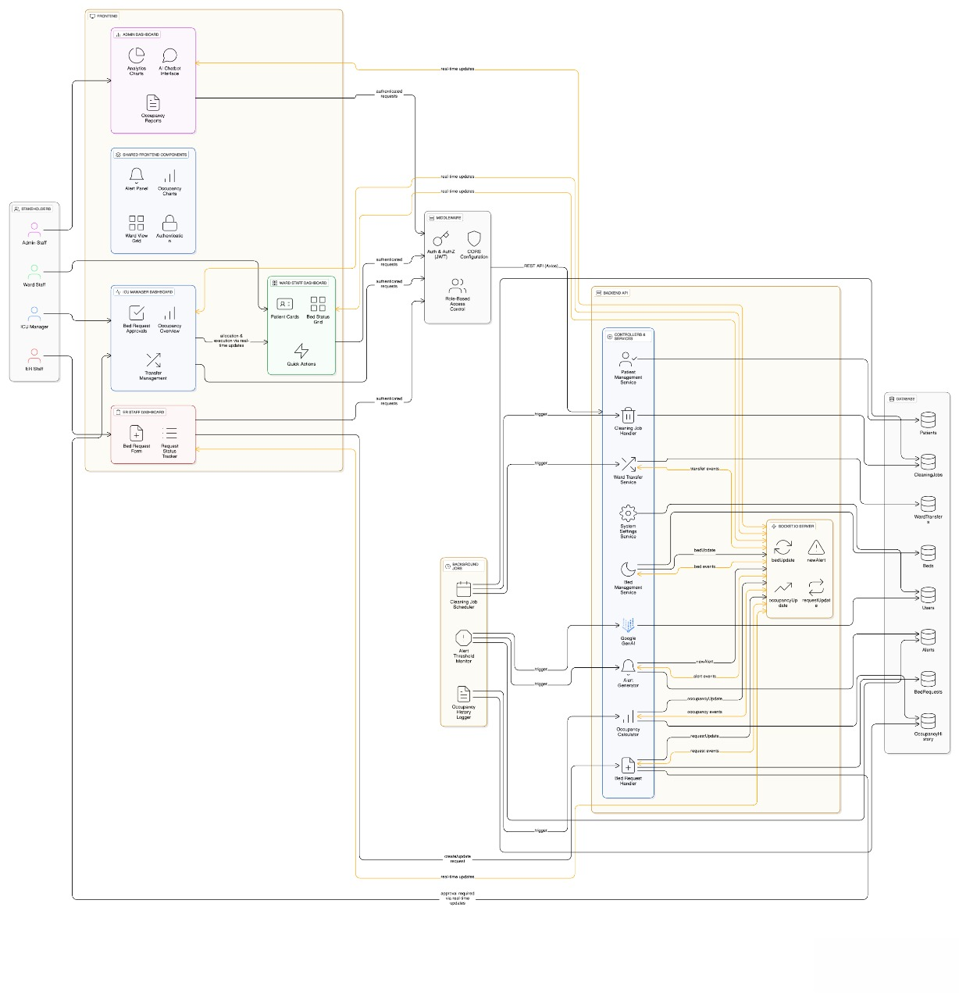
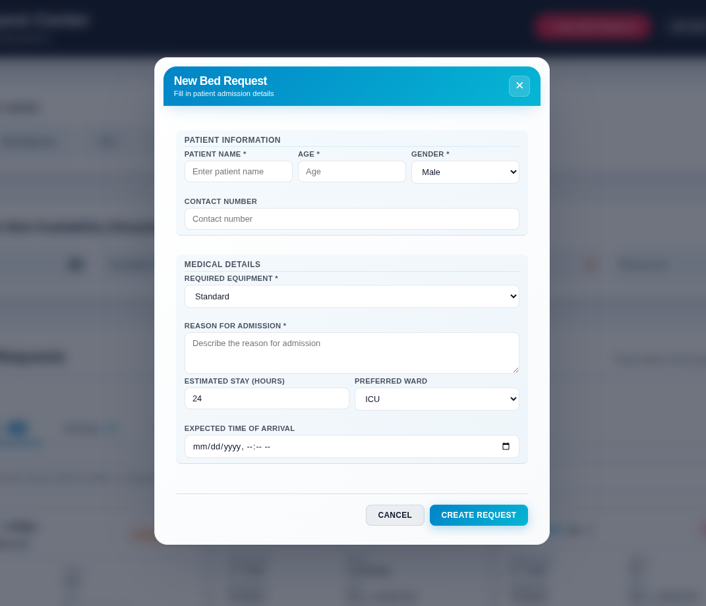
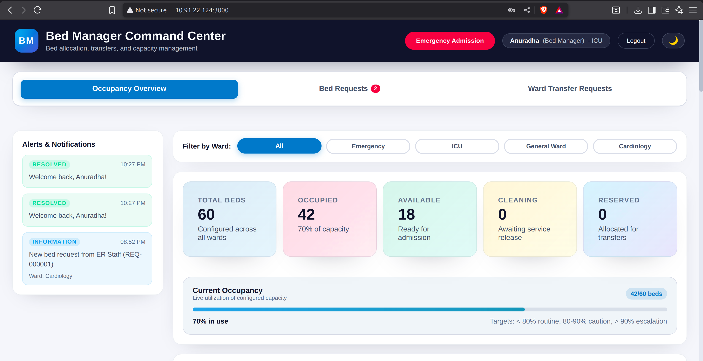
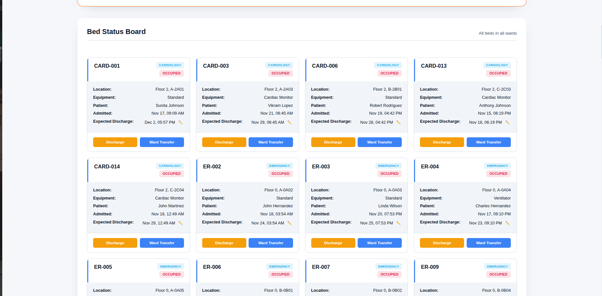
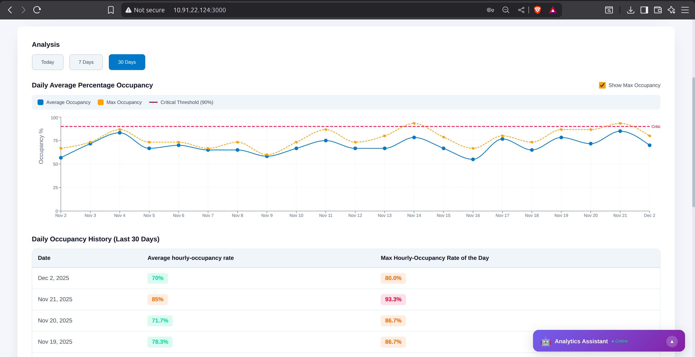

# 🏥 Hospital Bed Manager System

A comprehensive real-time hospital bed management system designed to streamline bed allocation, patient admissions, and resource optimization across emergency departments, ICU, and general wards.


## 📋 Table of Contents

- [Overview](#overview)
- [Features](#features)
- [Technology Stack](#technology-stack)
- [System Architecture](#system-architecture)
- [User Roles & Permissions](#user-roles--permissions)
- [Workflows](#workflows)
- [Installation](#installation)
- [Usage](#usage)
- [Default User Credentials](#default-user-credentials)
- [API Documentation](#api-documentation)

## 🎯 Overview

The Hospital Bed Manager System is a full-stack web application that provides real-time bed tracking, intelligent allocation, and comprehensive analytics for hospital operations. The system supports multiple user roles with specific permissions and workflows to ensure efficient patient care and resource utilization.

## ✨ Features

### Core Functionality
- **Real-time Bed Tracking**: Live updates on bed status across all wards
- **Smart Bed Allocation**: Intelligent bed suggestions based on patient requirements and equipment needs
- **Emergency & Scheduled Admissions**: Support for both urgent and planned patient admissions
- **Ward Transfers**: Seamless patient transfers between units
- **Occupancy Analytics**: Comprehensive dashboards with historical trends and forecasting
- **Alert System**: Automated alerts for capacity thresholds and critical situations
- **AI-Powered Chatbot**: Administrative assistant for data analysis and insights

### Advanced Features
- **60-Day Historical Tracking**: Detailed occupancy history with hourly breakdowns
- **Exponential Smoothing Forecasts**: Predictive analytics for capacity planning
- **Equipment Matching**: Bed allocation based on required medical equipment
- **Cleaning Workflow**: Bed hygiene tracking and management
- **Real-time Notifications**: WebSocket-based live updates
- **Multi-Ward Support**: Emergency, ICU, General Ward, and Cardiology departments

## 🛠 Technology Stack

### Frontend
- **React** (v18.2.0) - UI framework
- **Material-UI** (v7.3.5) - Component library
- **Recharts** (v2.7.2) - Data visualization
- **Socket.IO Client** (v4.6.1) - Real-time communication
- **Axios** (v1.4.0) - HTTP client

### Backend
- **Node.js & Express** (v4.18.2) - Server framework
- **MongoDB** (v6.3.0) - Database
- **Mongoose** (v7.6.3) - ODM
- **Socket.IO** (v4.7.2) - WebSocket server
- **JWT** (v9.0.2) - Authentication
- **bcrypt** (v6.0.0) - Password hashing
- **Google Generative AI** (v0.24.1) - AI chatbot

## 🏗 System Architecture




The system follows a client-server architecture with real-time bidirectional communication:
- **Frontend**: React SPA with role-based dashboards
- **Backend**: RESTful API with WebSocket support
- **Database**: MongoDB with Mongoose schemas
- **Real-time**: Socket.IO for live updates
- **AI Integration**: Google Gemini API for chatbot analytics

## 👥 User Roles & Permissions

### 1. ER Staff
**Primary Function**: Initiate and track bed requests for emergency and scheduled admissions

**Permissions**:
- ✅ Create emergency/urgent bed requests
- ✅ View request status and queue
- ✅ See filtered availability summary
- ❌ Cannot allocate beds or edit bed statuses

**Landing Page Features**:
- Emergency bed request form with patient details, preferred ward, and equipment requirements
- Request queue with status tracking (pending, approved, denied)
- Limited availability summary
- Real-time notifications on approval/denial



### 2. ICU Manager
**Primary Function**: Own bed allocation and transfers across ICU/wards; manage real-time capacity

**Permissions**:
- ✅ View full real-time occupancy across all wards
- ✅ Approve/deny/assign beds
- ✅ Initiate ward transfers
- ✅ Manage reservations
- ✅ Pause admissions when critical
- ❌ Cannot mark physical bed state changes (done by Ward Staff)

**Landing Page Features**:
- Real-time occupancy dashboard with filters
- Smart bed suggestion engine
- Request approval/denial console
- Transfer management interface
- Alert center for threshold breaches



### 3. Ward/Unit Staff
**Primary Function**: Operate beds on the ground—prepare, admit, discharge, and update bed statuses

**Permissions**:
- ✅ Update bed state lifecycle (available → reserved → occupied → cleaning → available)
- ✅ Record admit/discharge timestamps
- ✅ Modify expected discharge times
- ✅ Acknowledge bed allocations
- ✅ Initiate patient transfer requests
- ❌ Cannot allocate or reassign beds across units

**Landing Page Features**:
- Unit-specific bed board with status cards
- Queue of incoming allocations/reservations
- One-click state updates
- Discharge planner with expected discharge times
- Cleaning workflow logging



### 4. Hospital Administration
**Primary Function**: Review analytics and capacity trends; set planning parameters

**Permissions**:
- ✅ View utilization reports and trends
- ✅ Access forecasting analytics
- ✅ Configure reporting parameters
- ✅ Export comprehensive reports
- ✅ Use AI chatbot for data analysis
- ❌ Cannot allocate beds or modify real-time statuses

**Landing Page Features**:
- Today's hourly occupancy trend (ward-wise)
- 60-day historical analytics
- Exponential smoothing forecasts
- Policy/parameter configuration
- Export and scheduled report delivery
- AI-powered analytics chatbot




## 🔄 Workflows

### A) Emergency Admission (ER → ICU Manager → Ward Staff)

1. **ER Staff** creates emergency bed request with:
   - Patient details
   - Preferred ward
   - Required equipment
   - Patient ETA

2. **System** suggests candidate beds based on:
   - Ward availability
   - Equipment matching
   - Patient requirements

3. **ICU Manager** reviews and:
   - Approves assignment OR
   - Re-routes to alternative unit OR
   - Denies request with reason

4. **Upon Approval**:
   - Bed status: Available → Reserved
   - Job added to Ward Staff queue

5. **Ward Staff**:
   - Prepares bed
   - Changes status: Reserved → Occupied
   - Admission complete

6. **Upon Discharge**:
   - Ward Staff updates: Occupied → Cleaning → Available
   - Timestamps recorded for analytics

### B) Scheduled Admission/Reservation

1. **ER Staff or ICU Manager** creates scheduled request with:
   - Expected admission date and time
   - Patient details
   - Ward preference

2. **Bed Allocation**:
   - Status: Available → Reserved
   - Job queued for Ward Staff

3. **Time-Based Activation**:
   - Option to change Reserved → Occupied activates only after expected admission time

4. **Ward Staff** completes admission at scheduled time

### C) Ward Transfer

1. **Ward Staff** identifies transfer need or **ICU Manager** initiates transfer

2. **ICU Manager** approves transfer between wards

3. **System** coordinates:
   - Source bed release
   - Destination bed reservation

4. **Ward Staff** executes physical transfer and updates states

### D) Threshold Alert

1. **System** raises alert when:
   - Occupancy crosses threshold (e.g., >80%)
   - Forecast predicts shortage

2. **ICU Manager** reviews and may:
   - Adjust allocation policy
   - Postpone elective admissions
   - Initiate inter-ward transfers

3. **Ward Staff** executes operational changes

4. **Admin** reviews impact via analytics reports

## 🚀 Installation

### Prerequisites
- Node.js (v14 or higher)
- MongoDB (v6.0 or higher)
- npm or yarn

### Backend Setup

```bash
# Navigate to backend directory
cd backend

# Install dependencies
npm install

# Create .env file
cp .env.example .env

# Edit .env with your MongoDB connection string
# MONGODB_URI=your_mongodb_connection_string
# DB_PASSWORD=your_database_password
# GEMINI_API_KEY=your_google_gemini_api_key

# Start the server
npm start
```

The backend server will run on `http://localhost:5000`

### Frontend Setup

```bash
# Navigate to frontend directory
cd frontend

# Install dependencies
npm install

# Start the development server
npm start
```

The frontend will run on `http://localhost:3001`

### Quick Start (Both Servers)

```bash
# From project root
chmod +x start-all.sh
./start-all.sh
```

## 📖 Usage

### First Time Setup

1. **Start Backend**: The system automatically creates default users and initializes system settings

2. **Access Login Page**: Navigate to `http://localhost:3001`

3. **Login with Default Credentials** (see below)

4. **Import Seed Data** (Admin only):
   - Login as admin
   - Navigate to Settings tab
   - Upload `comprehensive_seed_data.json`
   - Click "Import Seed Data"

### Default User Credentials

| Role | Username | Password | Access Level |
|------|----------|----------|--------------|
| Administrator | `admin` | `admin123` | Full system access + analytics |
| ICU Manager | `anuradha` | `password123` | Bed allocation + transfers |
| Ward Staff | `wardstaff` | `ward123` | Bed status updates (General Ward) |
| ER Staff | `erstaff` | `er123` | Bed requests (Emergency) |

**⚠️ Important**: Change these passwords in production!

## 🔌 API Documentation

### Authentication
```
POST /api/login
Body: { username, password }
Response: { token, user }
```

### Beds
```
GET    /api/beds              - Get all beds
GET    /api/beds/stats        - Get bed statistics
POST   /api/beds              - Create new bed (Admin)
PUT    /api/beds/:id          - Update bed status
DELETE /api/beds/:id          - Delete bed (Admin)
```

### Bed Requests
```
GET    /api/bed-requests           - Get all requests
POST   /api/bed-requests           - Create new request
PUT    /api/bed-requests/:id       - Update request
POST   /api/bed-requests/:id/approve - Approve request
POST   /api/bed-requests/:id/deny    - Deny request
```

### Patients
```
GET    /api/patients                    - Get all patients
POST   /api/patients                    - Admit patient
PUT    /api/patients/:id                - Update patient
POST   /api/patients/:id/discharge      - Discharge patient
GET    /api/patients/discharges/today   - Today's discharges
```

### Ward Transfers
```
GET    /api/ward-transfers     - Get all transfers
POST   /api/ward-transfers     - Create transfer request
PUT    /api/ward-transfers/:id - Update transfer status
```

### System Settings
```
GET    /api/settings     - Get system settings
PUT    /api/settings     - Update settings (Admin)
```

### Analytics
```
GET    /api/beds/history?period=today|week|month - Occupancy history
POST   /api/chatbot      - Chat with AI assistant (Admin)
```

## 📊 Bed State Lifecycle

```
Available → Reserved → Occupied → Cleaning → Available
```

**Rules**:
- ❌ Cannot change: Reserved → Cleaning
- ❌ Cannot change: Cleaning → Occupied
- ✅ Must follow: Reserved → Occupied → Cleaning → Available

## 🔔 Real-time Events

The system uses WebSocket (Socket.IO) for real-time updates:

- `bed-updated` - Bed status changed
- `new-bed-request` - New request created
- `bed-request-approved` - Request approved
- `patient-admitted` - New admission
- `patient-discharged` - Patient discharged
- `ward-transfer-updated` - Transfer status changed
- `settings-updated` - System settings modified
- `beds-synced` - Ward capacity changed

## 🎨 Ward Configuration

Default wards and capacities:

| Ward | Capacity | Equipment Types |
|------|----------|----------------|
| Emergency | 10 beds | Standard, ICU Monitor |
| ICU | 20 beds | Ventilator, ICU Monitor, Dialysis |
| General Ward | 50 beds | Standard, Cardiac Monitor |
| Cardiology | 20 beds | Cardiac Monitor, Standard |

**Total**: 100 beds

## 📈 Analytics & Forecasting

### Occupancy Tracking
- Hourly snapshots (24 data points/day)
- 60-day historical data
- Ward-wise breakdowns
- Equipment utilization

### Forecasting
- **Method**: Exponential smoothing
- **Data**: Last 60 days hourly occupancy
- **Output**: Today's predicted hourly occupancy percentages
- **Use Case**: Proactive capacity planning

### AI Chatbot Capabilities
- Analyze admission/discharge patterns
- Answer occupancy queries
- Generate custom reports
- Identify trends and anomalies
- Provide recommendations


## 👨‍💻 Team

**Team 21**


**Built with ❤️ for better healthcare management**
